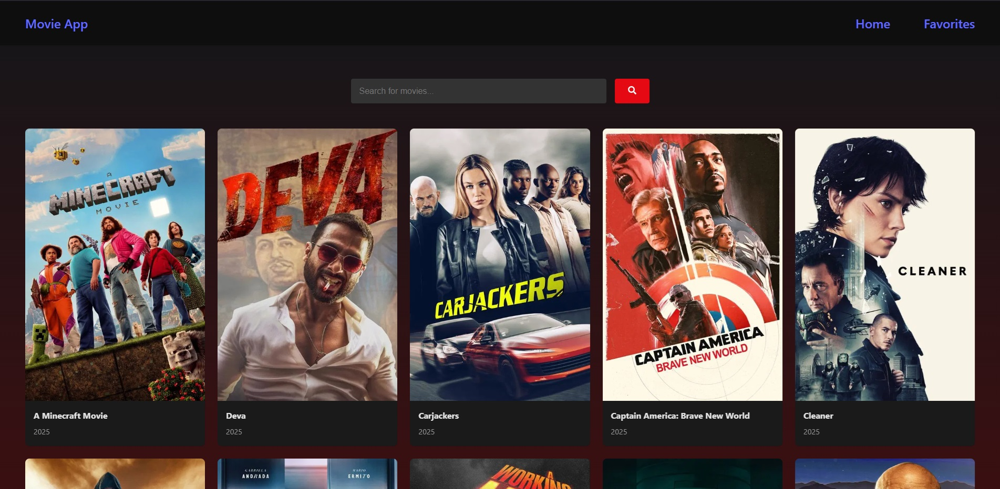
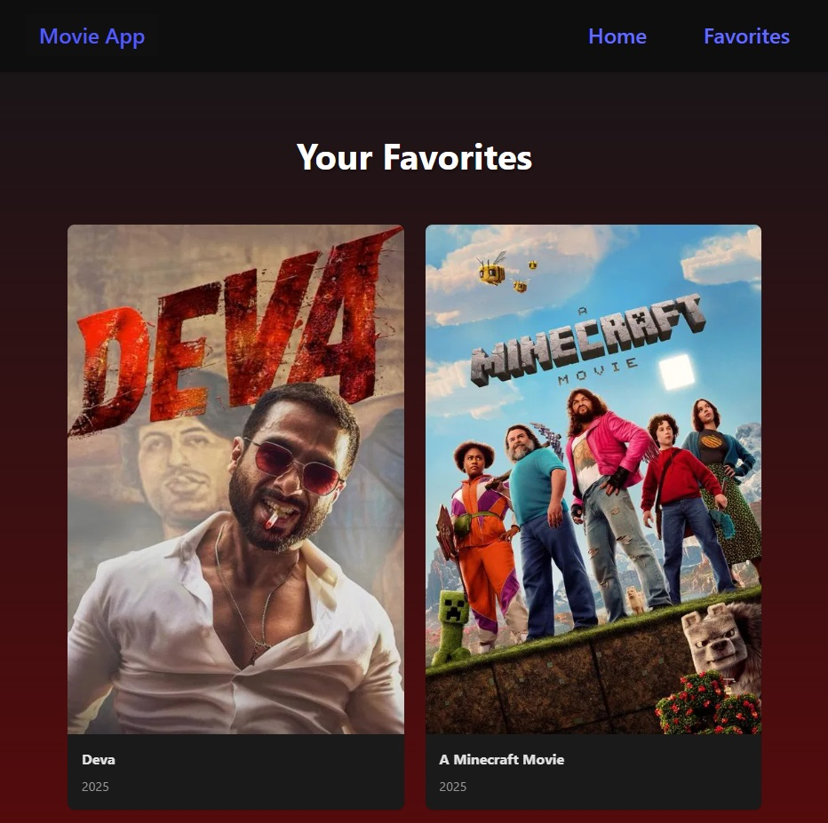

# MovieApp 🎬


## 📝 Overview

MovieHub is a modern React application showcasing my frontend development skills. The app allows users to browse popular movies, search for specific titles, and save their favorites for later viewing. Built with React 19 and Vite, this project demonstrates my ability to create responsive, interactive web applications using current best practices.

## ✨ Features

- **Movie Discovery**: Browse popular movies from TMDB API
- **Search Functionality**: Find specific movies by title
- **Favorites Management**: Save and manage favorite movies
- **Responsive Design**: Optimized for all device sizes
- **Modern UI**: Clean, intuitive interface with smooth animations

## 🛠️ Technologies Used

- **React 19**: Latest version with hooks and context for state management
- **React Router 7**: For seamless navigation between pages
- **React Icons**: For beautiful, scalable icons
- **React Toastify**: For user-friendly notifications
- **The Movie Database API**: For fetching movie data
- **Vite**: For fast development and optimized builds
- **Context API**: For global state management
- **CSS3**: For styling and animations

## 🏗️ Project Structure

```
movie_app/
├── public/           # Static files
├── src/
│   ├── assets/       # Images and other assets
│   ├── components/   # Reusable UI components
│   │   ├── MovieCard/
│   │   └── Navbar/
│   ├── contexts/     # React Context providers
│   │   └── MovieContext.jsx
│   ├── pages/        # Application pages
│   │   ├── Home/
│   │   └── Favorites/
│   ├── services/     # API services
│   │   └── api.js
│   ├── App.jsx       # Main application component
│   └── main.jsx      # Application entry point
└── index.html        # HTML template
```

## 🚀 Getting Started

### Prerequisites

- Node.js (version 16 or above)
- npm or yarn

### Installation

1. Clone the repository

```bash
git clone https://github.com/yourusername/movie-app.git
cd movie-app
```

2. Install dependencies

```bash
npm install
# or
yarn
```

3. Create a `.env` file in the root directory with your TMDB API key

```
VITE_API_KEY=your_api_key_here
```

4. Start the development server

```bash
npm run dev
# or
yarn dev
```

5. Open your browser and navigate to `http://localhost:5173`

## 📱 Screenshots





## 🧠 What I Learned

During the development of this project, I enhanced my skills in:

- Building complex React applications with multiple components
- Managing global state with React Context API
- Working with external APIs and handling asynchronous operations
- Implementing responsive design principles
- Optimizing React applications for performance

## 🔮 Future Improvements

- Add user authentication
- Implement movie details page
- Add movie ratings and reviews
- Create custom lists beyond favorites
- Add dark/light theme toggle

## 📄 License

This project is licensed under the MIT License - see the [LICENSE](LICENSE) file for details.

---

Built with ❤️ by Murat Guler
